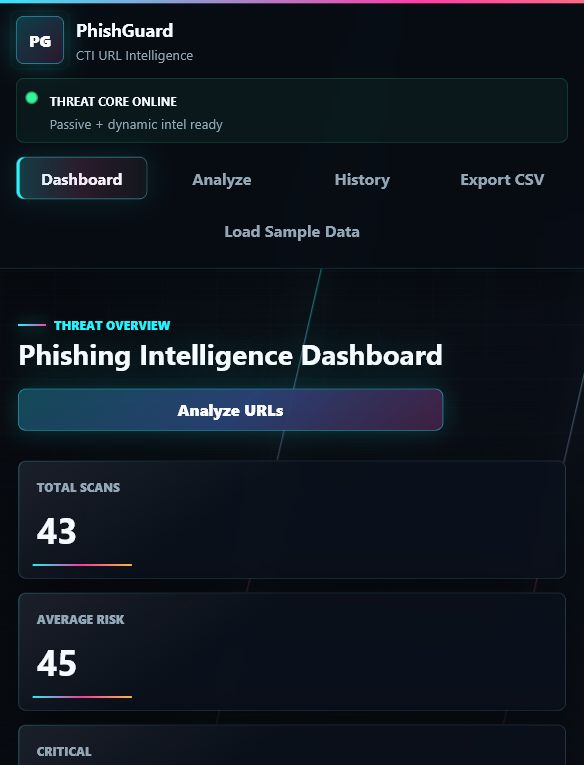
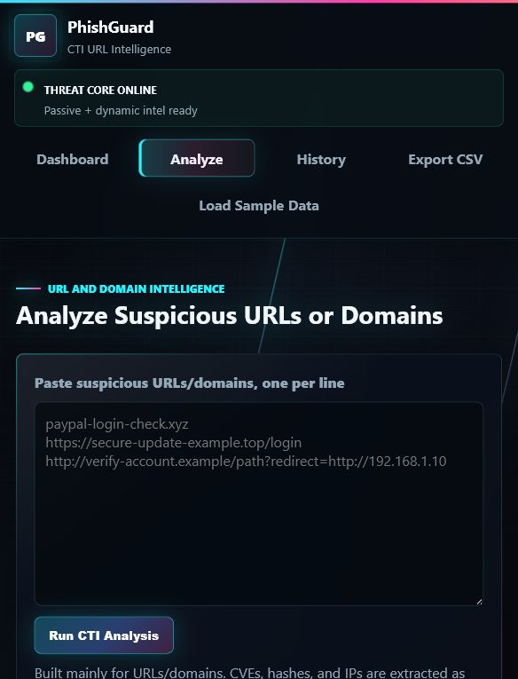
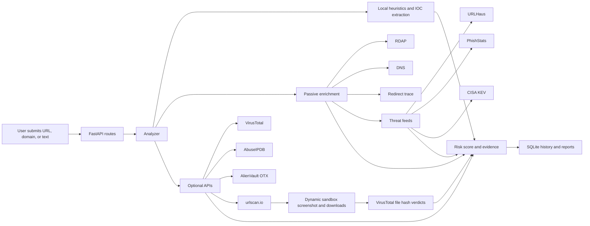

# PhishGuard CTI

[](https://www.python.org/)
[](https://fastapi.tiangolo.com/)
[](https://phishguard-cti.vercel.app/)
[](https://github.com/hamzajawad11/phishguard-cti/actions/workflows/tests.yml)

PhishGuard is a cyber threat intelligence platform for suspicious URL and domain investigation. It turns links into explainable risk scores, enriched intelligence, dynamic sandbox evidence, IOC extraction, saved history, and analyst-ready reports.

Live demo: [phishguard-cti.vercel.app](https://phishguard-cti.vercel.app/)

Safe sandbox demo URL:

```text
https://phishguard-cti.vercel.app/secure-login/account/verify/billing/update?redirect=http%3A%2F%2F192.168.10.20%2Fportal&continue=microsoft-office-sso&session=verify-account-payment-update&token=ZXhhbXBsZS1kZW1v
```

This demo URL is intentionally suspicious-looking but harmless. It exists to test PhishGuard's scoring, dynamic urlscan.io screenshot capture, and download-detection workflow.

## Preview





## What It Does

PhishGuard is built for tactical CTI and SOC-style triage:

- Analyzes URLs, domains, and suspicious text submissions.
- Extracts IOCs including URLs, domains, IP addresses, hashes, and CVEs.
- Scores risk from transparent evidence instead of black-box labels.
- Enriches indicators with RDAP, DNS, redirects, feeds, optional reputation APIs, and urlscan.io.
- Supports active dynamic scanning through urlscan.io.
- Detects observed downloads and checks file hashes with VirusTotal.
- Saves investigations to SQLite for local/demo use.
- Exports reports as JSON, printable HTML, and CSV history.

## Key Capabilities

| Area | Capability |
| --- | --- |
| URL heuristics | HTTPS checks, IP hosts, punycode, risky TLDs, URL shorteners, long URLs, deep paths, encoded characters, redirect parameters |
| Phishing signals | Suspicious keywords, brand impersonation hints, embedded IP indicators |
| Passive intelligence | RDAP domain age, registrar, expiry, DNS A/AAAA/MX/NS/TXT records, redirect trace |
| Public feeds | URLHaus, PhishStats, CISA Known Exploited Vulnerabilities catalog |
| Optional APIs | VirusTotal, AbuseIPDB, AlienVault OTX, urlscan.io |
| Dynamic sandbox | urlscan.io browser scan, screenshot link, DOM link, final URL, observed downloads |
| File verdicts | Download hash extraction and VirusTotal file-hash lookup |
| Reporting | Dashboard, history, filters, JSON export, HTML report export, CSV export |

## Architecture



## Live Demo Notes

The hosted Vercel demo is useful for UI and workflow testing, but Vercel serverless storage is temporary. SQLite records can reset or appear inconsistent across instances.

For reliable long-term history and stable report URLs, deploy with persistent storage:

- Vercel Postgres
- Neon Postgres
- Supabase Postgres
- Railway Postgres
- Render or Fly.io with persistent disk/database

## Quick Start

```powershell
git clone https://github.com/hamzajawad11/phishguard-cti.git
cd phishguard-cti
python -m venv .venv
.\.venv\Scripts\Activate.ps1
python -m pip install --upgrade pip
python -m pip install -r requirements.txt
python -m uvicorn app.main:app --reload
```

Open:

```text
http://127.0.0.1:8000
```

## Optional API Keys

The app works without keys, but optional providers improve enrichment quality.

Copy the example file:

```powershell
Copy-Item .env.example .env
```

Configure values:

```text
VIRUSTOTAL_API_KEY=
ABUSEIPDB_API_KEY=
OTX_API_KEY=
URLSCAN_API_KEY=
ENABLE_URLSCAN_SUBMISSION=false
URLSCAN_VISIBILITY=unlisted
URLSCAN_INITIAL_WAIT_SECONDS=10
URLSCAN_POLL_INTERVAL_SECONDS=5
URLSCAN_POLL_TIMEOUT_SECONDS=45
```

Important:

- Never commit `.env`.
- Keep `ENABLE_URLSCAN_SUBMISSION=false` for passive urlscan.io search only.
- Set `ENABLE_URLSCAN_SUBMISSION=true` only when you intentionally want to submit URLs to urlscan.io for dynamic browser scanning.
- Use `URLSCAN_VISIBILITY=unlisted` or `private` when supported by your account.

## Demo Inputs

Use these for a quick classroom or portfolio demonstration:

```text
https://www.microsoft.com/security
http://login-microsoft-security-update.xyz/verify/account?redirect=http://192.168.10.20
http://paypal.com.account-verify-login.top/session/update
http://bit.ly/security-verification-login
paypal-login-check.xyz
verify-account-update.top
```

Safe dynamic sandbox demo:

```text
https://phishguard-cti.vercel.app/secure-login/account/verify/billing/update?redirect=http%3A%2F%2F192.168.10.20%2Fportal&continue=microsoft-office-sso&session=verify-account-payment-update&token=ZXhhbXBsZS1kZW1v
```

## Testing

```powershell
python -m pytest
```

Current local suite:

```text
34 tests passing
```

## Deployment

### Vercel

This repository includes a Vercel-compatible FastAPI entrypoint at:

```text
app/app.py
```

Vercel detects the FastAPI app and deploys from the GitHub repository.

### Render

`render.yaml` is included for Render-style Python hosting:

```text
Build command: pip install -r requirements.txt
Start command: uvicorn app.main:app --host 0.0.0.0 --port $PORT
```

### Docker

```powershell
docker build -t phishguard-cti .
docker run --rm -p 8000:8000 phishguard-cti
```

## Project Structure

```text
app/
  analyzer.py          URL parsing, IOC extraction, and risk scoring
  config.py            Timeouts, limits, and shared configuration
  database.py          SQLAlchemy engine and session management
  dns_intel.py         DNS record enrichment
  domain_intel.py      RDAP/domain-age intelligence
  enrichment.py        URLHaus, PhishStats, and CISA KEV enrichment
  main.py              FastAPI routes and web pages
  optional_sources.py  VirusTotal, AbuseIPDB, OTX, and urlscan.io integrations
  redirects.py         Passive redirect tracing
  reports.py           CSV, JSON, and HTML report rendering
  static/              UI CSS, JavaScript, and logo
  templates/           Jinja dashboard, analyzer, history, and report pages
tests/                 Backend tests
data/                  Runtime SQLite database
```

## Security Scope

PhishGuard is a defensive CTI project. It does not collect credentials, execute downloaded files, or perform exploitation. The included attacker-style demo URL is intentionally harmless and exists only for detection, screenshot, and download-observation testing.

## Authors

Ali Ahsan / Hamza Jawad / Arun Lal / Taha Nasir
